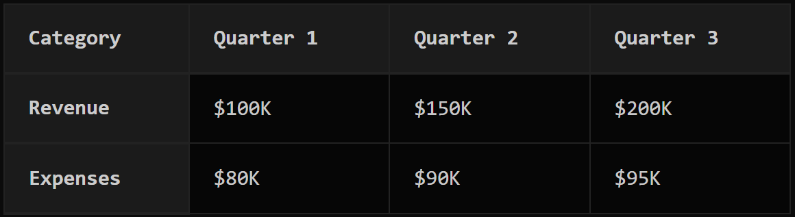
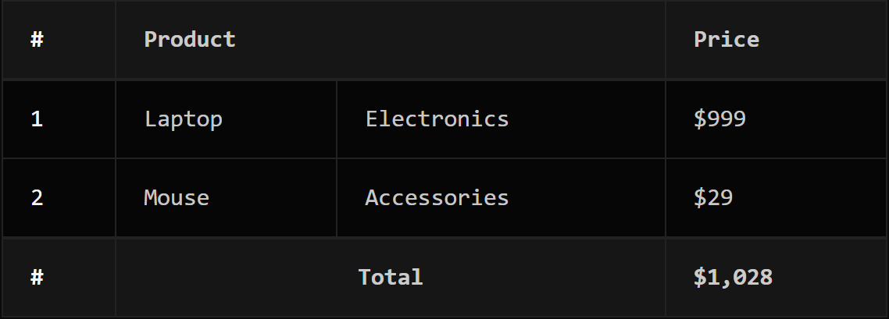

# Changelog

All notable changes to this project will be documented in this file.

The format is based on [Keep a Changelog](https://keepachangelog.com/en/1.0.0/),
and this project adheres to [Semantic Versioning](https://semver.org/spec/v2.0.0.html).

## [Unreleased]

### Added
- **cellType attribute support** for semantic header/data cell rendering
  - Cells can now specify `cellType="header"` or `cellType="data"` to control rendering
  - Allows body and footer cells to be rendered as header cells (`<th>`) when semantically appropriate
  - Header section cells automatically render as `<th>` by default (cellType is redundant there)
- Updated to `structured-table@^0.2.1` with full cellType parsing support
- Improved accessibility and semantic HTML structure

### Examples

**Using cellType in body rows:**
```stl
| Name {cellType=header} | Age | City |
| John Doe | 30 | New York |
| Jane Smith | 25 | Los Angeles |
```

**Row headers in data tables:**
```stl
[header]
Category | Quarter 1 | Quarter 2 | Quarter 3

[body]
Revenue {cellType=header} | $100K | $150K | $200K
Expenses {cellType=header} | $80K | $90K | $95K
```

### Preview 


### Migration Guide

No breaking changes. The `cellType` attribute is optional and backward compatible:
- Existing tables without `cellType` will continue to work as before
- Header section cells render as `<th>` automatically
- Body and footer cells render as `<td>` by default
- Add `cellType="header"` to body/footer cells when they represent row/column headers

## [0.2.0] - 2026-01-30

### Added
- **STL Editor** with live preview for intuitive table creation
- Support for multiple cell types:
  - Text cells (default)
  - Link cells with `[link href=...]` attribute
  - Button cells with `[button action=...]` attribute
- **Table attributes** support:
  - `colSpan` - Merge cells horizontally
  - `rowSpan` - Merge cells vertically
  - `align` - Text alignment (left, center, right)
- **Table sections**:
  - Header section (rows starting with `[header]`)
  - Body section (rows starting with `[body]`)
  - Footer section (rows starting with `[footer]`)
- **SSR friendly** - Works with server-side rendering
- **Sanity v3-v5 support** - Compatible with Sanity Studio v3, v4, and v5

### Dependencies
- `structured-table@^0.2.1` - Core STL parsing and rendering
- `react@>=18` - React 18 or higher
- `sanity@^3.0.0 || ^4.0.0 || ^5.0.0` - Sanity Studio v3, v4, or v5

### Example

```stl
[header]
Product {colSpan=2} | Price |

[body]
Laptop | Electronics | $999 |
Mouse | Accessories | $29 |

[footer]
Total {colSpan=2, align=center} | $1,028 |
```

### Preview


## [0.1.0] - 2025-12-17 (Legacy)

### Features
- Basic STL (Structured Table Language) support
- Text, link, and button cell types
- Basic attributes: `colSpan`, `rowSpan`, `align`
- No `cellType` attribute support

### Limitations
- Body and footer cells could not be rendered as `<th>` elements
- Limited semantic HTML capabilities

---

## Links

- [GitHub Repository](https://github.com/ameghcoder/sanity-plugin-stl-table)
- [NPM Package](https://www.npmjs.com/package/sanity-plugin-stl-table)
- [STL Playground](https://stl.fysk.dev/playground)
- [Structured Table Language](https://github.com/ameghcoder/structured-table)
- [Documentation](https://github.com/ameghcoder/sanity-plugin-stl-table#readme)

## Support

For issues, questions, or contributions, please visit our [GitHub Issues](https://github.com/ameghcoder/sanity-plugin-stl-table/issues).